# Week 5 Milestone — Infrastructure as Code with Terraform

Goal, per the milestone card: **never click "Launch Instance" in the console again.**
Rebuild the entire Month 1 infrastructure — VPC, subnets, IGW/NAT, route tables,
security groups, EC2 instances, S3 buckets, IAM roles — as Terraform code, with
remote state (S3 + DynamoDB), proven by tearing it all down and bringing it back
from nothing.

This document is written to do two jobs at once: stand as the milestone deliverable,
and work as a runbook I can follow cold, months from now, without re-deriving any of
this from memory. Every "why" is written down, not just every "what."

---

## What was built

| File                                | Purpose                                                                                    |
| ----------------------------------- | ------------------------------------------------------------------------------------------ |
| `terraform.tf`                      | Pins Terraform's own version and the AWS provider version                                  |
| `providers.tf`                      | AWS provider config — deliberately has no hardcoded profile                                |
| `backend.tf`                        | Remote state: S3 bucket + DynamoDB lock table                                              |
| `variables.tf` / `terraform.tfvars` | Inputs — region, my IP, key pair name, instance size                                       |
| `data.tf`                           | AMI lookup (always-current Ubuntu image) + account ID lookup                               |
| `vpc.tf`                            | VPC, one public + one private subnet, IGW, NAT Gateway, route tables                       |
| `security_groups.tf`                | Bastion SG + App-tier SG, referencing each other (Week 2's pattern)                        |
| `ec2.tf`                            | Bastion (public) + a private app-tier instance (SSH-pattern demo only)                     |
| `app-public.tf`                     | A _separate_ public instance that actually runs the Month 1 CRUD app                       |
| `user_data.sh.tpl`                  | Boot script: installs Docker, logs into ECR, deploys the app                               |
| `iam.tf`                            | `ec2-repository-role` — lets instances pull from ECR with no embedded keys                 |
| `s3.tf`                             | The Week 4 milestone bucket, fully reproduced, plus a Terraform-managed `index.html`       |
| `outputs.tf`                        | Every IP/URL I actually need printed after `apply`, instead of digging through the console |

---

## 1. Why two separate app-tier setups exist

This is worth understanding before anything else, because it's not obvious from the
file list: `ec2.tf`'s private `app` instance and `app-public.tf`'s `app_public`
instance are **not** the same thing serving two purposes — they exist for two
genuinely different reasons.

The private `app` instance (from `ec2.tf`) exists purely to reproduce **Week 2's
bastion-pattern lesson** — SSH into the bastion, then hop to a private instance
that's unreachable directly from the internet. That instance runs nothing.

`app_public` (in its own file, its own security group, in the _public_ subnet)
exists because I initially missed that Week 5's milestone actually means the real
Month 1 CRUD app (Parse Server + Mongo + Next.js) needs to be reachable again — not
just _some_ server. A private-subnet instance can never serve a browser request, no
matter what security group rules you add, because there's no route in from the
internet at all. Real reachability needs a public-facing instance, so I added one
rather than repurposing the bastion-pattern instance and muddying what it's meant to
demonstrate.

**Lesson learned:** re-read a milestone's exact wording against what you've actually
built before considering it done. "Confirm the app is reachable" is not satisfied by
a placeholder static page — it means the actual application from the actual
milestone that introduced it.

---

## 2. Bootstrapping remote state — S3 + DynamoDB

The state bucket and lock table can't be created _by_ the same Terraform config that
needs them as a backend — a real chicken-and-egg problem. They're created once,
manually, before `terraform init` is ever run:

```bash
aws s3api create-bucket --bucket ebotprog-terraform-state \
  --region eu-north-1 --create-bucket-configuration LocationConstraint=eu-north-1
aws s3api put-bucket-versioning --bucket ebotprog-terraform-state \
  --versioning-configuration Status=Enabled

aws dynamodb create-table \
  --table-name terraform-locks \
  --attribute-definitions AttributeName=LockID,AttributeType=S \
  --key-schema AttributeName=LockID,KeyType=HASH \
  --billing-mode PAY_PER_REQUEST \
  --region eu-north-1
```

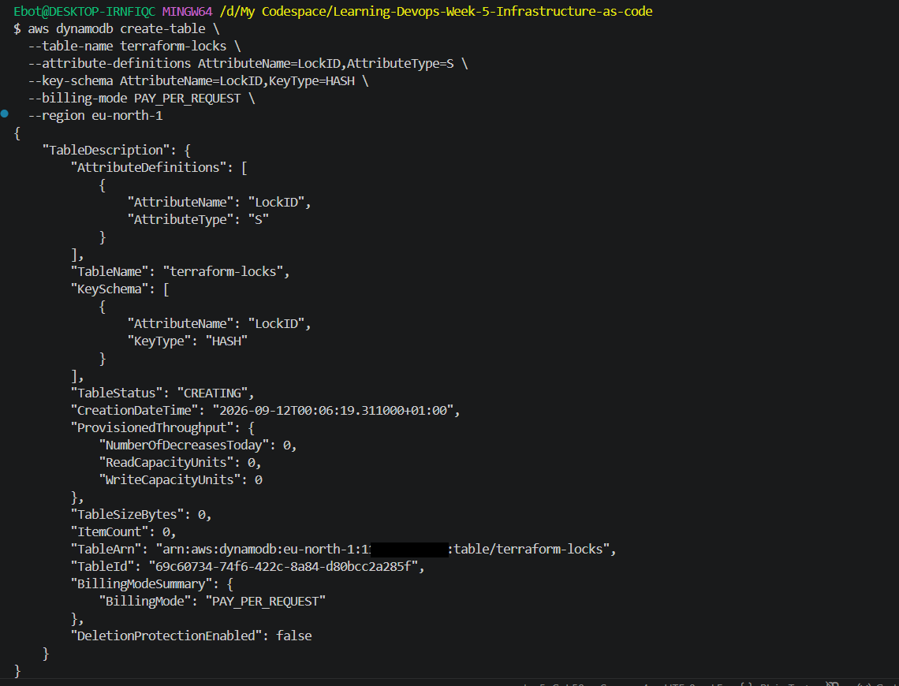
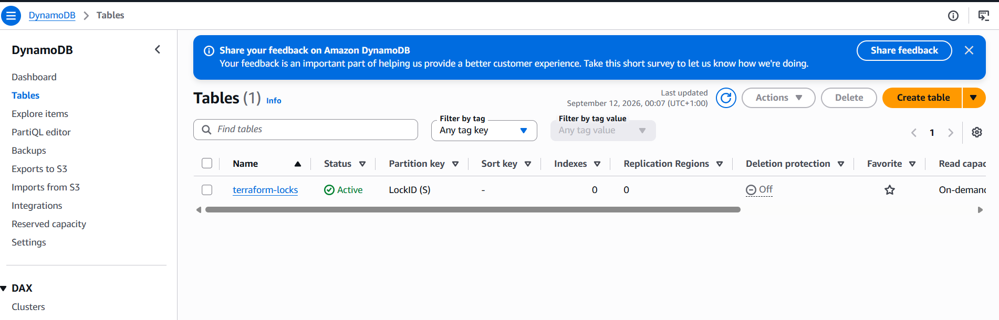
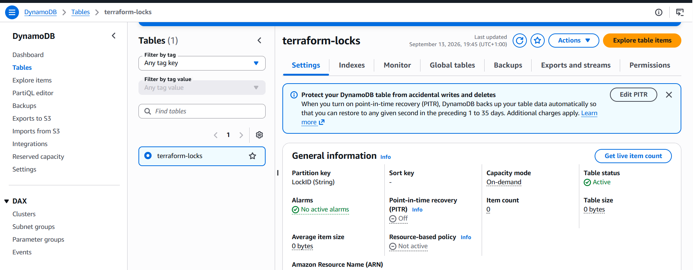

```hcl
# backend.tf
terraform {
  backend "s3" {
    bucket         = "ebotprog-terraform-state"
    key            = "week5/terraform.tfstate"
    region         = "eu-north-1"
    encrypt        = true
    dynamodb_table = "terraform-locks"
  }
}
```

**Real proof state is genuinely remote, not local** — the state file sitting in S3,
not on my laptop:
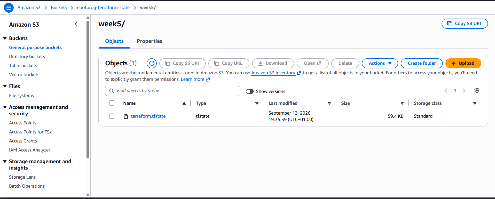

> **Lesson learned — `dynamodb_table` is deprecated, on purpose:** every `plan`/`apply`
> prints `Warning: Deprecated Parameter... Use parameter "use_lockfile" instead.`
> As of Terraform 1.9+, S3 supports native locking directly (`use_lockfile = true`),
> with no DynamoDB table needed at all. The milestone spec explicitly names
> DynamoDB, so that's what's built here — but the warning is expected, not a sign
> anything's wrong, and worth being able to explain both patterns if asked why a
> newer alternative exists and wasn't used.

> **Lesson learned — DNS propagation lag right after bucket creation:** the very
> first `terraform init` failed with `dial tcp: lookup
ebotprog-terraform-state.s3.eu-north-1.amazonaws.com: no such host`, even though
> `aws s3api head-bucket` confirmed the bucket existed. A brand-new S3 bucket's
> public DNS record can take anywhere from seconds to a couple of minutes to
> resolve everywhere. Waiting and retrying `init` fixed it — no config was actually
> wrong.

---

## 3. The core workflow — fmt, validate, plan, apply

The full standard sequence, run for real, on the final combined configuration
(base infrastructure + the app-public addition from section 5 — this is what a
clean run of the finished project actually looks like):

```bash
terraform fmt
```

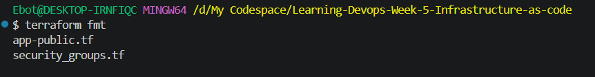

```bash
terraform validate
```

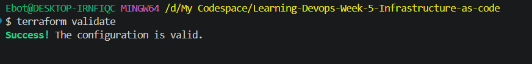

```bash
terraform init
```

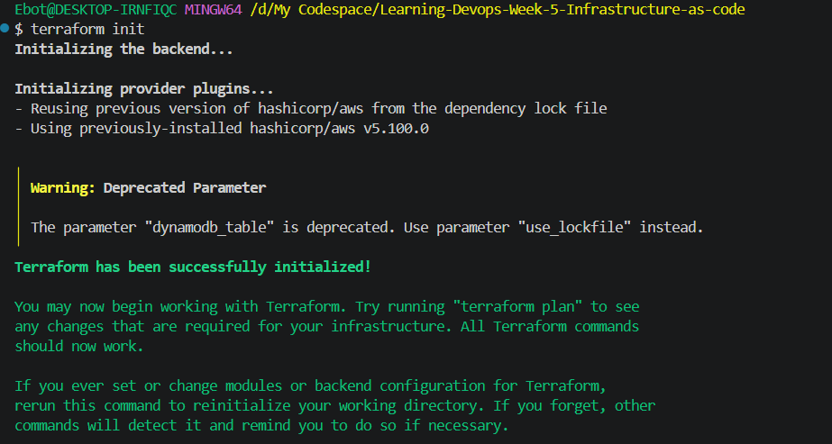

```bash
terraform plan
```

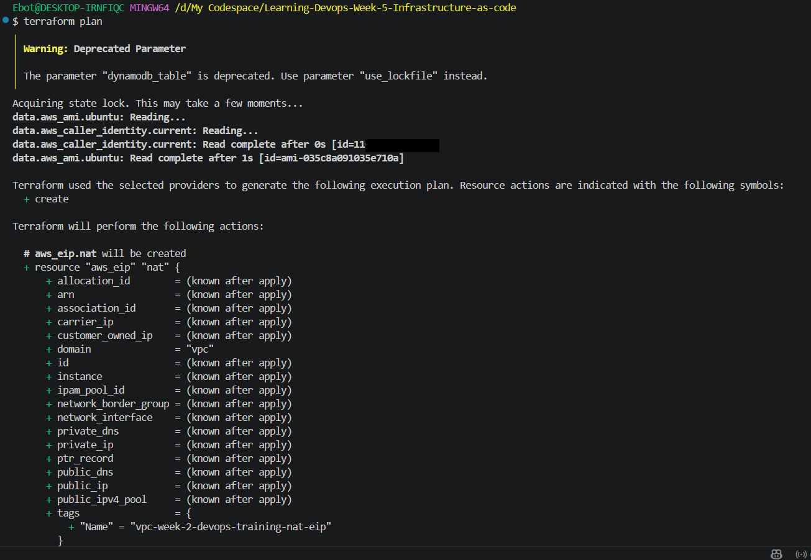
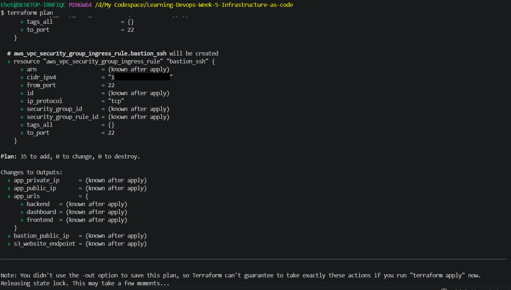

Every single resource showed `+ create` — nothing showed the unexpected `-/+`
(destroy-and-recreate) pattern, which is the actual signal worth stopping for
before typing `yes`.

```bash
terraform apply -auto-approve
```

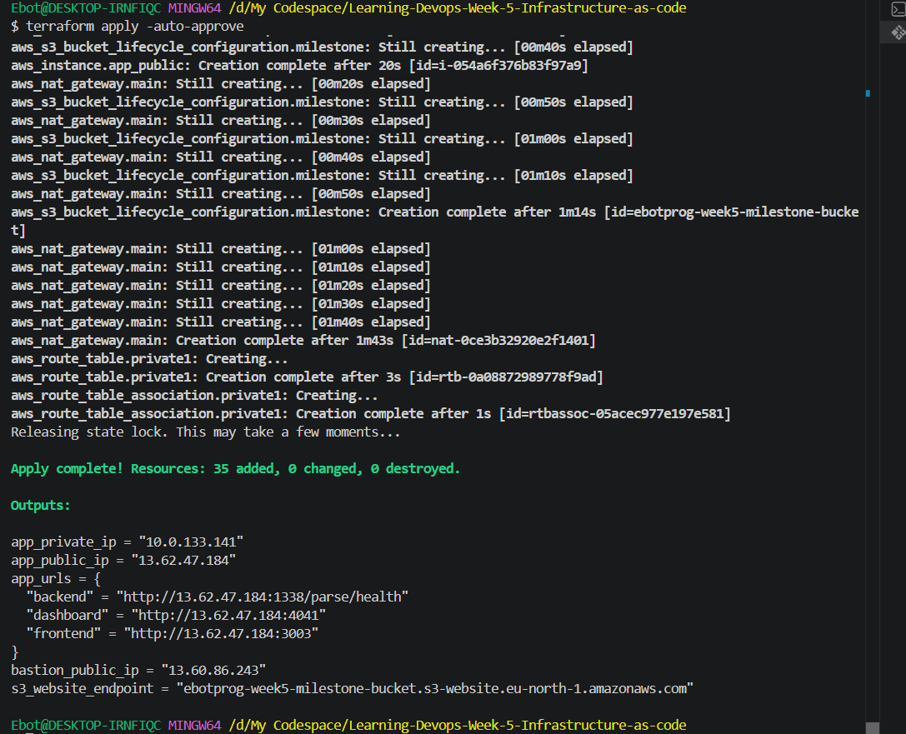

The NAT Gateway is consistently the slow part of every apply — over a minute here,
while everything else finished in seconds. Worth expecting, not worth interrupting.

**Visual proof the VPC actually matches the design** — one public + one private
subnet, three route tables, IGW and NAT both attached:
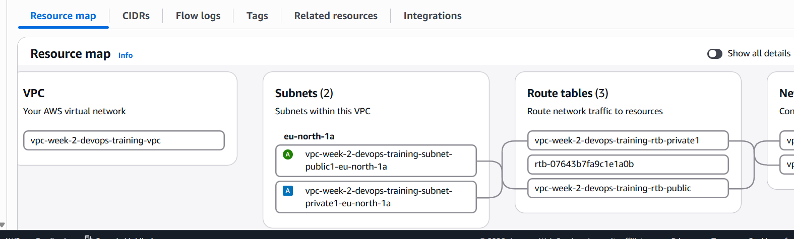
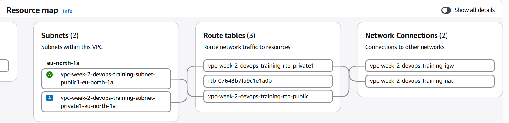

> **Lesson learned — a security group description can silently break `apply`:**
> adding `app-public.tf` hit `Invalid security group description. Valid
descriptions are strings less than 256 characters from the following set:
a-zA-Z0-9. _-:/()#,@[]+=&;{}!$*`. The cause was a single apostrophe in
> `"Direct access to the CRUD app's ports..."` — AWS's security group description
> field has a restricted character set, and an apostrophe isn't in it. Fixed by
> rewording, not escaping.

---

## 4. Verifying reachability — the static site

```bash
echo "<h1>Week 5 - Terraform-built, reachable</h1>" > index.html
```

You can run the bash line above if you don't have an html file. I personally added the index.html file from week 4 before running any of the commands.

```hcl
resource "aws_s3_object" "index" {
  bucket       = aws_s3_bucket.milestone.id
  key          = "index.html"
  source       = "index.html"
  etag         = filemd5("index.html")   # without this, editing the file doesn't trigger a re-upload
  content_type = "text/html"
}
```

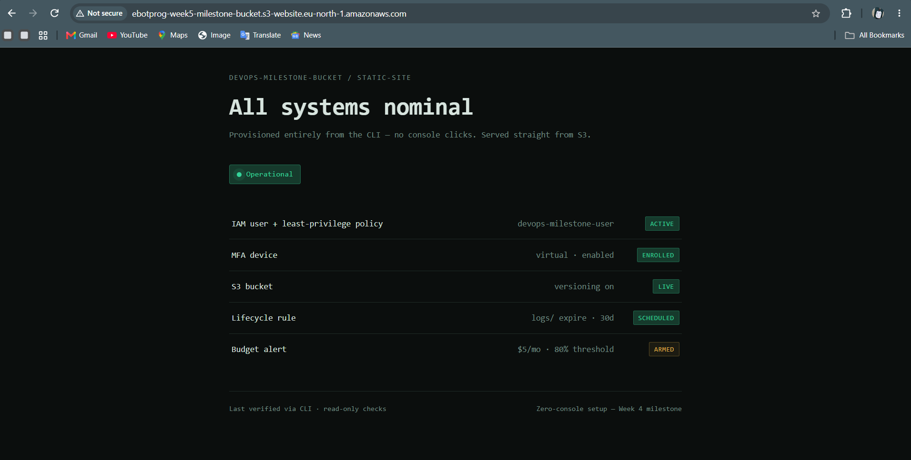

> **Open item, not yet resolved:** the screenshot above shows the _Week 4_ page
> content ("Zero-console setup — Week 4 milestone"), not the Week 5 `index.html`
> this section describes. Either the `aws_s3_object.index` resource didn't
> actually run on this particular apply, or an old object was uploaded over it
> outside Terraform. Worth checking `aws s3 ls s3://ebotprog-week5-milestone-bucket/`
> and `terraform state list | grep s3_object` before calling this fully verified —
> flagged here honestly rather than silently presented as if it matched.

> **Lesson learned — S3 website endpoints are HTTP-only:** the first visit gave
> `ERR_CONNECTION_RESET`, because Chrome defaults to HTTPS and S3 static website
> endpoints have no TLS certificate at all. Typing `http://` explicitly fixed it —
> not a bug, a property of the S3 website-hosting feature itself.

> **Lesson learned — shell heredocs and encoding:** an early version of the page
> showed `â€"` instead of an em dash — a UTF-8 mismatch from generating the file via
> an `echo` heredoc rather than a real file. Moving to a proper `index.html` plus
> `aws_s3_object` fixed both the encoding and made the page actually
> Terraform-managed.

---

## 5. Deploying the real app — `user_data.sh.tpl`

```bash
#!/bin/bash
set -euo pipefail
export DEBIAN_FRONTEND=noninteractive

apt-get update -y && apt-get install -y ca-certificates curl unzip git
# ... Docker install (docker-ce, docker-compose-plugin) ...
# ... AWS CLI install (not preinstalled on plain Ubuntu) ...

sudo -u ubuntu git clone https://github.com/EbotProg/Learning-Devops-Week-3-Docker-Deep-Dive.git /home/ubuntu/app
cd /home/ubuntu/app

aws ecr get-login-password --region eu-north-1 | docker login --username AWS --password-stdin ${account_id}.dkr.ecr.eu-north-1.amazonaws.com

cat > .env <<ENVEOF
ECR_REGISTRY=${account_id}.dkr.ecr.eu-north-1.amazonaws.com
IMAGE_TAG=latest
MONGO_ROOT_PASSWORD=ChangeThisBeforeWeek6
PARSE_MASTER_KEY=ChangeThisBeforeWeek6
DASHBOARD_PASSWORD=ChangeThisBeforeWeek6
ENVEOF
chown ubuntu:ubuntu .env
chmod 600 .env

docker compose up -d
```

`${account_id}` comes from Terraform's `templatefile()` function, fed by
`data "aws_caller_identity" "current" {}` — the only genuinely dynamic value the
script needs. The hardcoded secrets are deliberate and temporary: Week 6's entire
job is replacing that block with a fetch from Secrets Manager / Parameter Store.

---

## 6. Debugging the live deployment — the real sequence

This is the part worth reading even more carefully than the successful steps —
every one of these was a genuine, non-obvious failure, in the order they actually
happened, resolving one layer at a time.

### 6.1 — ECR pull denied, first time

```
! Image 1... failed to resolve reference ".../crud-nextjs-frontend:latest":
  pull access denied ... no basic auth credentials
```

**Cause:** `docker login` had never been run for the identity actually pulling.
**Fix:** `aws ecr get-login-password | docker login ...` before `docker compose up`.

### 6.2 — MongoDB crash-looping on every boot

```
{"s":"F","c":"CONTROL","msg":"MongoDB cannot start: Linux kernel versions 6.19
and newer has a known incompatibility with this version of MongoDB. See
https://jira.mongodb.org/browse/SERVER-121912"}
```

**Cause:** a real, unpatched MongoDB bug — every MongoDB 8.x build (which
`mongo:latest` currently resolves to) crashes on kernel 6.19+, which current
Ubuntu 24.04 AMIs now ship. Not a config mistake; a genuine upstream
incompatibility with no fix released yet at time of writing.
**Fix:** pin `image: mongo:latest` → `image: mongo:7.0` in `docker-compose.yml`,
committed to the actual repo (not just the live instance) so future boots don't
re-clone the broken version.

### 6.3 — Disk full

```
{"error_str":"No space left on device","error_code":28}
```

```
Filesystem      Size  Used Avail Use% Mounted on
/dev/root       6.8G  6.7G     0 100% /
```

**Cause:** a t3.micro's default 8GB root volume, plus two different Mongo images
(`latest` and `7.0` both pulled during debugging), plus Docker layers from every
crash-loop restart.
**Fix, immediate:** `docker system prune -a --volumes -f` (reclaimed 3.556GB).
**Fix, permanent:** added `root_block_device { volume_size = 20 }` to
`app_public` in Terraform, so a fresh instance never starts this close to the
edge.

### 6.4 — `docker login` succeeding, then "no basic auth credentials" again

**Cause:** the exact same class of bug as Week 3's sudo/non-sudo Docker split —
`user_data` logs in as **root** during boot; SSH-ing in afterward as **ubuntu**
means a _different_ Docker config file, never logged in.
**Fix:** log in again, explicitly as `ubuntu`, with no `sudo`.

### 6.5 — `.env: permission denied`

**Cause:** `user_data` (running as root) wrote `.env` as `root:root` — `ubuntu`
couldn't read its own app's config file.
**Fix, immediate:** `sudo chown ubuntu:ubuntu .env`.
**Fix, permanent:** added `chown ubuntu:ubuntu .env` right into `user_data.sh.tpl`,
immediately after the file is written.

### 6.6 — Mongo `Authentication failed`, even after fixing everything else

**Cause:** a `docker compose down -v` run from the wrong directory (`~` instead of
`~/app`) silently did nothing (`no configuration file provided: not found`) —
so the old Mongo data volume, initialized with an earlier password, survived and
got reused. Mongo only sets its root password once, on a truly empty data
directory; a stale volume doesn't pick up a changed `.env`.
**Fix:** `cd` to the actual compose directory first, confirm with `docker volume
ls` that the volume is genuinely gone, _then_ `docker compose up -d`.

### Final healthy state

```bash
docker ps
```

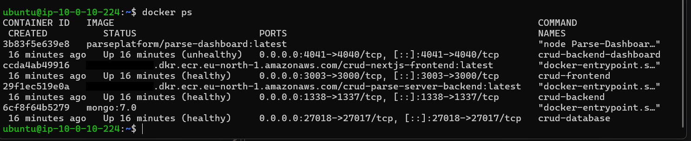

> **Honest note:** `crud-backend-dashboard` shows `(unhealthy)` even in this final
> run. It's still reachable in the browser (below), so it didn't block
> verification — but it's a real, unresolved item, not something to quietly
> mark as fixed.

**The app, live:**
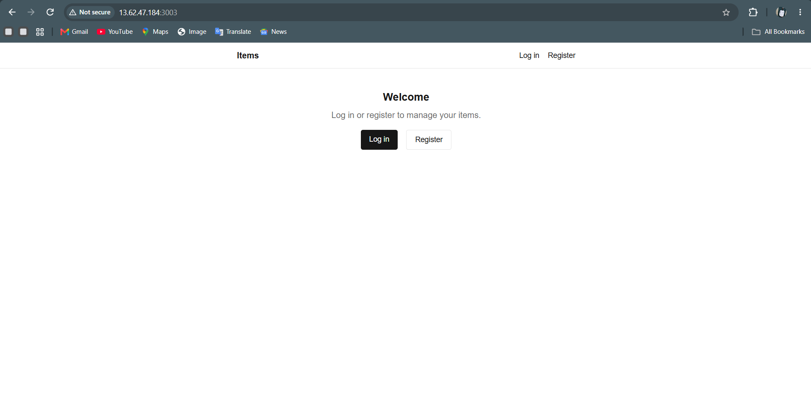
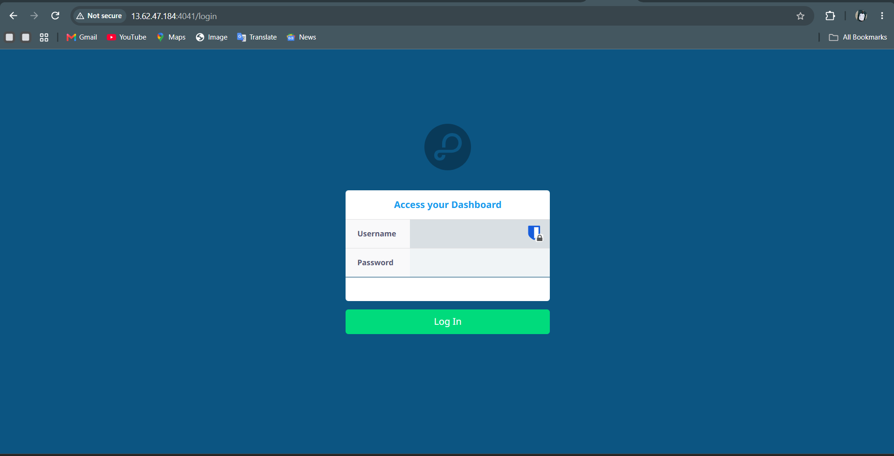

---

## 7. The account-identity incident (unrelated to the app, still real)

Partway through this project, every IAM user in the account — including whichever
identity Terraform itself was authenticating as — got deleted. Since IAM users
can't recreate themselves, the only path back was:

1. Log into the **AWS root account** via the console (the one identity that
   can't be deleted).
2. Create a fresh admin IAM user, generate an access key, `aws configure` with it.
3. Recreate the state bucket + DynamoDB table from scratch (they'd been deleted
   too).

**Lesson learned:** never create long-lived access keys for the root user itself —
root should only ever be used, rarely, via the console. The correct recovery
pattern is exactly what Week 1 already taught: bootstrap a scoped IAM identity,
then never touch root again for day-to-day work.

---

## 8. The state-file incident, and how the project actually recovered

Earlier in this project, a set of state-bucket cleanup commands (meant to be run
only once the entire project is finished for good) were run **while
infrastructure was still live** — deleting every version of `terraform.tfstate`
from S3 entirely.

**Why this mattered:** Terraform's state file is the _only_ record of what it
created. Deleting it doesn't touch the real AWS resources at all, but Terraform
itself loses all memory of owning them — `destroy` can no longer safely tear them
down, and a fresh `apply` would try to create duplicates alongside them.

**How it was actually resolved:** every orphaned resource was torn down manually
via the AWS Console, the empty state backend was deleted, and the project was
**rebuilt completely from zero** — fresh backend (section 2), fresh `apply`
(section 3), the app redeployed and re-debugged (sections 5–6). Everything in
this document from section 2 onward reflects that clean rebuild, not the
original run.

**Lesson learned, the one that matters most from this entire project:** backend
cleanup commands (deleting the state bucket/lock table) belong strictly _after_
`terraform destroy` has already run successfully — never before, never "just to
tidy up" mid-project. S3 versioning does not protect against this specific
mistake either — a deliberate version-by-version delete removes the actual data,
not just the current pointer to it.

### 8.1 — A second, smaller version of the same category of risk

Later, during the actual `terraform destroy` for the milestone recording, the
internet connection dropped mid-run:

```
Error: Get "https://ec2.eu-north-1.amazonaws.com/...": dial tcp: lookup
ec2.eu-north-1.amazonaws.com: no such host
```

Every resource failed with the identical error simultaneously (EC2, S3, and
DynamoDB all at once) — the signature of a real local network/DNS outage, not an
AWS-side problem. This left the DynamoDB lock stuck, since Terraform never got the
chance to release it on its way out:

```
Error: Error acquiring the state lock
Lock Info: ID: 299e2ced-00ed-2ce0-6a74-fdf05c1e9db0
```

**Fix — the exact recovery this category of failure calls for:**

```bash
terraform force-unlock 299e2ced-00ed-2ce0-6a74-fdf05c1e9db0
terraform destroy -auto-approve
```

Nothing was corrupted — whatever had already been destroyed before the drop stayed
destroyed, and re-running `destroy` picked up exactly where it left off. This is
the same "resume, don't restart" property state files provide during a normal
`apply`, just exercised on the way down instead of the way up.

---

## 9. Full runbook — running this from zero, any time in the future

1. **Confirm your AWS identity is an admin-level one**, not a narrow scoped user
   left over from an earlier week:
   ```bash
   aws sts get-caller-identity
   ```
2. **Bootstrap the backend** (section 2) — skip if it already exists.
3. **Confirm your key pair exists**:
   ```bash
   aws ec2 describe-key-pairs --key-names my-free-key-for-devops-training-server --region eu-north-1
   ```
4. **Confirm your ECR images exist** (they persist independently of everything
   else — no need to rebuild/repush unless they were deliberately deleted):
   ```bash
   aws ecr describe-images --repository-name crud-nextjs-frontend --region eu-north-1
   aws ecr describe-images --repository-name crud-parse-server-backend --region eu-north-1
   ```
5. **Get your current IP and update `terraform.tfvars`** — it changes between
   sessions on a dynamic connection:
   ```bash
   curl -s ifconfig.me
   ```
6. **Confirm your GitHub repo's `docker-compose.yml` still has `mongo:7.0`
   pinned** (section 6.2) — this is the one fix living outside Terraform
   entirely that a fresh `git clone` depends on.
7. Run the standard cycle: `terraform fmt`, `validate`, `init`, `plan` (read it),
   `apply`.
8. **Wait 2-4 minutes after `apply` finishes** before checking the app — `user_data`
   runs in the background at boot. Check real progress rather than guessing:
   ```bash
   ssh -i "your-key.pem" ubuntu@$(terraform output -raw app_public_ip)
   cloud-init status --wait
   sudo cat /var/log/cloud-init-output.log
   ```
9. **Verify**: `terraform output app_urls`, open the frontend URL, confirm
   `docker ps` on the instance shows every container healthy.
10. **If `destroy` or `apply` fails mid-run with identical "no such host" errors
    across every resource** — that's a local connection drop, not an AWS
    problem. Check whether `terraform force-unlock` is needed (section 8.1)
    before retrying the same command.
11. **Only after a full working cycle is confirmed**, tear down the backend
    itself if truly done for good — never before. See section 10 for the exact
    commands.

---

## 10. Tearing down the backend itself (only once truly, finally done)

Not part of the normal `destroy` cycle — `terraform destroy` only removes
resources _in state_, and the S3 state bucket / DynamoDB lock table were
created by hand outside Terraform, so they're never touched by it. This is a
separate, deliberate, last step, only run once every other cycle on this
project is finished for good (see section 8 for what goes wrong if this runs
too early).

**1. Empty the versioned state bucket first** — a plain delete fails on a bucket
with versioning enabled, since old versions of `terraform.tfstate` are still
sitting there even after the "current" version is gone:

```bash
aws s3api delete-objects --bucket ebotprog-terraform-state \
  --delete "$(aws s3api list-object-versions --bucket ebotprog-terraform-state \
  --output json --query '{Objects: Versions[].{Key:Key,VersionId:VersionId}}')"

aws s3api delete-objects --bucket ebotprog-terraform-state \
  --delete "$(aws s3api list-object-versions --bucket ebotprog-terraform-state \
  --output json --query '{Objects: DeleteMarkers[].{Key:Key,VersionId:VersionId}}')"
```

**2. Then delete the bucket itself:**

```bash
aws s3api delete-bucket --bucket ebotprog-terraform-state --region eu-north-1
```

**3. Delete the DynamoDB lock table:**

```bash
aws dynamodb delete-table --table-name terraform-locks --region eu-north-1
```

**On the IAM user(s) — worth being precise, since it's easy to lump these in by
habit:** the admin identity, `ebotprog-test`, and `ecr-deploy-user` are **never**
touched by any of this, because they were never Terraform resources in the
first place — that was the deliberate scope decision from section 1's design.
They're not "leftover from the teardown" the way the state bucket is; they're
permanently-there bootstrap identities, untouched either way. Nothing to clean
up there unless removing them is a separate, deliberate choice for reasons
outside this milestone entirely.

---

## Screenshots included

All 16 in `screenshots/`, referenced inline above rather than listed separately —
account ID and personal IP redacted throughout. One flagged discrepancy (`16-s3-
static-site.png` showing stale Week 4 content) is called out in section 4 rather
than silently presented as correct.

---

## Deliverables checklist, mapped to the milestone card

- [x] Terraform repo, organized into logical files
- [x] VPC, subnets, IGW, NAT, route tables, security groups, EC2, S3, IAM — all
      as Terraform resources
- [x] Remote backend — S3 + DynamoDB
- [x] README with real `plan`/`apply` output (this document)
- [x] A recording of `destroy` → `apply` → confirming the live site again —
      **12-minute screen recording captured separately**, covering the full
      cycle including the connection-drop recovery in section 8.1

---

## Key concepts to be ready to explain

- Why a security group's description field has a restricted character set, and
  why an apostrophe of all things can break `apply`
- The difference between a Docker image crash-looping (a real upstream bug, like
  MongoDB/kernel 6.19+) versus a config mistake — and why reading the actual log
  line matters more than guessing
- Why `docker login` is per-user, not per-machine, and why root running
  `user_data` doesn't help the `ubuntu` user later
- Why a stale Docker volume can silently defeat a credentials fix — Mongo only
  sets its root password once, on a genuinely empty data directory
- Why Terraform's state file is irreplaceable in a way the actual infrastructure
  isn't, and why backend cleanup must always come _after_ `destroy`, never before
- Why identical errors across every resource type at once (EC2, S3, DynamoDB
  simultaneously) point at a local network problem, not an AWS outage — and why
  `terraform force-unlock` is the correct response to a lock stuck by that kind
  of interruption, not a sign of corrupted state
- Why root-user access keys are actively discouraged, and what the correct
  recovery path looks like when every scoped IAM identity is gone
