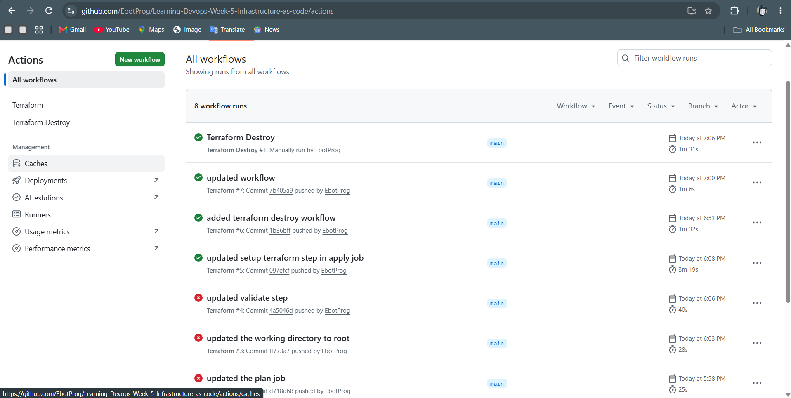
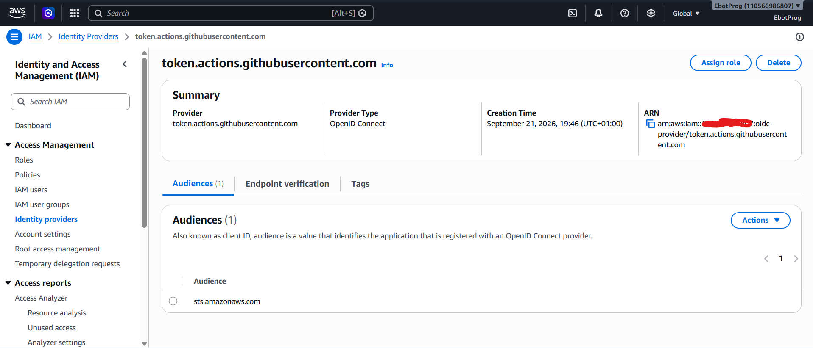
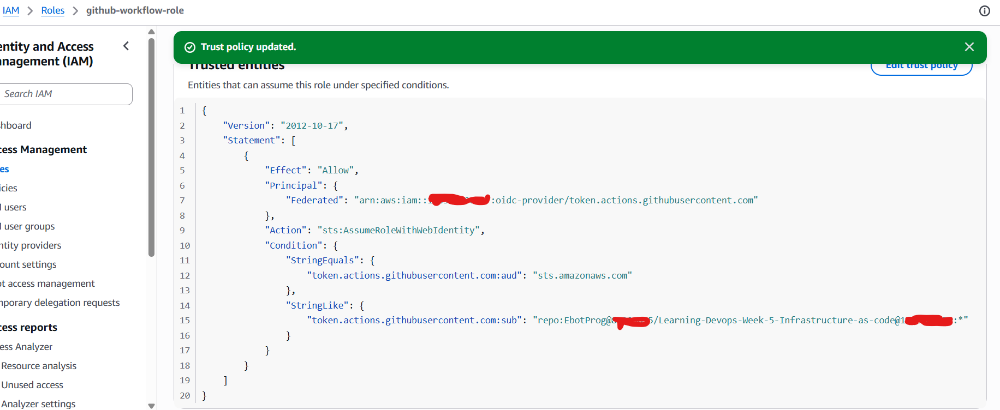
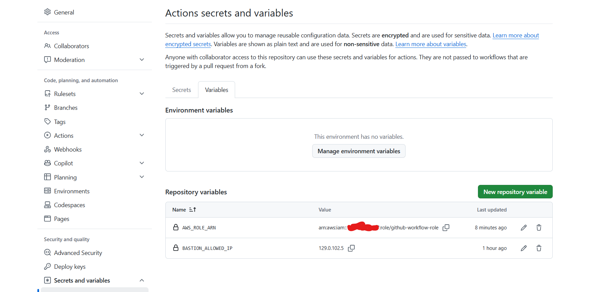

# CI/CD Pipeline — Terraform on AWS via GitHub Actions (Week 5)

Repo: `Learning-Devops-Week-5-Infrastructure-as-code`

This document explains how the GitHub Actions pipeline for this Week 5 Terraform project was set up, what it does, which variables/secrets had to be created, and every issue that came up while building it.

> **Folder structure this README expects:**
>
> ```
> project-root/
> ├── README.md                     ← this file
> ├── screenshots/
> │   └── pipeline/
> │       ├── github-workflows.png
> │       ├── identity-provider.png
> │       ├── role-to-be-assumed-by-workflow.png
> │       └── github-variables.png
> ├── .github/
> │   └── workflows/
> │       └── terraform.yml
> ├── vpc.tf
> ├── security_groups.tf
> ├── ec2.tf
> ├── app-public.tf
> ├── iam.tf
> ├── s3.tf
> ├── backend.tf
> ├── data.tf
> ├── providers.tf
> ├── outputs.tf
> ├── variables.tf
> ├── terraform.tfvars
> └── user_data.sh.tpl
> ```
>
> Everything lives flat at the project root — there is **no `environments/` split and no `modules/` folder** in Week 5. That's a Week 6 change (see the Week 6 README). Week 5 is a single VPC (2 AZs, 2 public/private subnets), one bastion, one app instance, one Terraform state, deployed as one thing.

---

## 1. What this pipeline does

`terraform.yml` runs `fmt`, `validate`, and `plan` on every pull request and push to `main`, and runs `apply` automatically after a push to `main` (using the exact plan that was reviewed). There is **no matrix** — one `plan` job, one `apply` job, one deployment target.


_Actions tab showing the Terraform workflow's run history for this repo._

---

## 2. Prerequisites set up once, outside the workflow file

### 2.1 Remote state backend (S3)

Terraform state is stored remotely so a fresh GitHub-hosted runner (which has nothing on disk) can read the current state on every run.

- S3 bucket for state (versioning + encryption enabled, public access blocked)
- Locking via DynamoDB table or S3-native `use_lockfile = true` on newer Terraform versions
- A single state file for the whole project (`terraform.tfstate`) — there's only one environment here, so there's no per-environment state key to manage.

### 2.2 OIDC identity provider (no stored AWS keys)

Instead of long-lived AWS access keys in GitHub Secrets, the workflow authenticates using **GitHub OIDC**: GitHub issues a short-lived signed token per workflow run, and AWS exchanges it for temporary credentials.

Created once in **IAM → Identity providers**:

- Provider type: OpenID Connect
- Provider URL: `https://token.actions.githubusercontent.com`
- Audience: `sts.amazonaws.com`


_The GitHub OIDC provider registered in IAM, with `sts.amazonaws.com` as its audience._

### 2.3 IAM role assumed by the workflow

Created an IAM role (`github-workflow-role`) with a **trust policy** that only allows this specific GitHub repository to assume it via OIDC.


_Trust policy on `github-workflow-role`, restricted to this repo via the `sub` condition._

```json
{
  "Version": "2012-10-17",
  "Statement": [
    {
      "Effect": "Allow",
      "Principal": {
        "Federated": "arn:aws:iam::<ACCOUNT_ID>:oidc-provider/token.actions.githubusercontent.com"
      },
      "Action": "sts:AssumeRoleWithWebIdentity",
      "Condition": {
        "StringEquals": {
          "token.actions.githubusercontent.com:aud": "sts.amazonaws.com"
        },
        "StringLike": {
          "token.actions.githubusercontent.com:sub": "repo:<OWNER>/<REPO>:*"
        }
      }
    }
  ]
}
```

> **Note:** this repo's actual `sub` claim came back in an **ID-suffixed format** (`repo:owner@<ownerID>/repo@<repoID>:ref:...`) instead of the plain `repo:owner/repo:*` format — see Issue #1 below. Adjust the `StringLike` value to match whatever your own token actually contains; don't assume the plain format works without checking.

The role's **permissions policy** (not shown) grants only what Terraform needs to manage: VPC/networking and EC2 (bastion + app instance), plus read/write on the S3 state bucket and lock table — not `AdministratorAccess`.

### 2.4 GitHub repository variables

Set under **Settings → Secrets and variables → Actions**:


_Repository-level variables used by the workflow._

| Type     | Name                 | Purpose                                                      |
| -------- | -------------------- | ------------------------------------------------------------ |
| Variable | `AWS_ROLE_ARN`       | ARN of `github-workflow-role`, assumed via OIDC in every job |
| Variable | `BASTION_ALLOWED_IP` | The IP allowed to SSH into the bastion                       |

**Variables** (`vars.*`) are plain text and fine for non-sensitive config like an ARN or an IP. Both are exposed to the workflow as environment variables (e.g. `TF_VAR_bastion_allowed_ip`) so Terraform can pick them up as input variables without hardcoding anything in `.tfvars`.

---

## 3. Workflow triggers

```yaml
on:
  pull_request:
    branches: [main]
    paths: ["*.tf", "*.tfvars"]
  push:
    branches: [main]
    paths: ["*.tf", "*.tfvars"]
  workflow_dispatch:
```

- **`pull_request`** → runs `fmt` / `validate` / `plan` so reviewers can see the plan output before merging.
- **`push` to `main`** → runs `plan` again, then `apply` (only on push, never on a PR).
- **`workflow_dispatch`** → allows a manual run from the Actions tab.
- **`paths`** → only triggers when a root-level `.tf`/`.tfvars` file changes, to avoid wasted runs. (Caveat: this also means edits to the workflow file itself won't trigger a run unless `.github/workflows/**` is included in `paths` too — see Issue #3.)

---

## 4. Job flow, high level

```
        plan
   terraform plan
   -out=tfplan
        │
   upload artifact
   "tfplan"
        │
        ▼
       apply
   download "tfplan"
   terraform apply tfplan
```

- `plan` writes a binary plan file (`terraform plan -out=tfplan`) and uploads it as a GitHub **artifact** named `tfplan`.
- `apply` **downloads that exact artifact** and applies it (`terraform apply tfplan`), rather than re-planning — this guarantees apply does exactly what was reviewed.
- `apply` has `needs: plan`, and only runs on a push to `main`.
- **Important distinction:** the artifact _name_ is only a storage label for GitHub — the file on disk is still just called `tfplan` both before upload and after download. `terraform apply` must reference the literal filename `tfplan`, not the artifact name.

---

## 5. Setup checklist (order that actually worked)

1. Create the S3 state bucket + lock table/lockfile config; add the `backend "s3"` block.
2. Create the OIDC identity provider in IAM.
3. Create the IAM role with a trust policy scoped to this repo, and attach a scoped permissions policy.
4. Add `AWS_ROLE_ARN` and `BASTION_ALLOWED_IP` as repository variables.
5. Add the workflow file under `.github/workflows/`.
6. Turn on branch protection on `main` (require PRs + passing checks).
7. Open a small test PR, confirm the plan output looks right, merge, and confirm apply runs.

---

## 6. Issues hit while building this pipeline (and fixes)

**1. OIDC `sub` claim didn't match the trust policy (`Not authorized to perform sts:AssumeRoleWithWebIdentity`)**
The trust policy assumed the default subject format `repo:owner/repo:*`, but this repo's actual token subject came back as `repo:owner@<ownerID>/repo@<repoID>:ref:refs/heads/main` (an ID-suffixed format). Diagnosed by decoding the OIDC token in a debug step:

```yaml
- name: Debug OIDC subject
  run: |
    TOKEN=$(curl -sH "Authorization: bearer $ACTIONS_ID_TOKEN_REQUEST_TOKEN" \
      "$ACTIONS_ID_TOKEN_REQUEST_URL&audience=sts.amazonaws.com" | jq -r .value)
    echo "$TOKEN" | cut -d. -f2 | tr '_-' '/+' | awk '{ while (length($0) % 4) $0 = $0 "="; print }' | base64 -d | jq '{sub, aud, iss}'
```

Fixed by updating the `StringLike` condition to match the real subject, including the numeric owner/repo IDs.

**2. `permissions: content: write` typo**
Should be `contents` (plural). A single missing letter caused an early workflow failure.

**3. Workflow file edits silently not triggering a run**
The `paths` filter only watched the root `.tf`/`.tfvars` files. A push that only edited the workflow YAML itself matched nothing, so GitHub didn't run the workflow at all — no failed run even appeared in the Actions tab. Fixed by adding `.github/workflows/**` to the `paths` filter, and using manual `workflow_dispatch` runs when testing pipeline-only changes.

**4. `terraform fmt -check -recursive` failing (exit code 3)**
A file had inconsistent alignment of `=` signs (leftover from editing one variable without realigning the rest). Not a logic bug — fixed locally with:

```bash
terraform fmt -recursive
git add -A && git commit -m "Format with terraform fmt" && git push
```

---

## 7. Useful debug snippets

**See the real OIDC subject a workflow is sending:**

```yaml
- name: Debug OIDC subject
  run: |
    TOKEN=$(curl -sH "Authorization: bearer $ACTIONS_ID_TOKEN_REQUEST_TOKEN" \
      "$ACTIONS_ID_TOKEN_REQUEST_URL&audience=sts.amazonaws.com" | jq -r .value)
    echo "$TOKEN" | cut -d. -f2 | tr '_-' '/+' | awk '{ while (length($0) % 4) $0 = $0 "="; print }' | base64 -d | jq '{sub, aud, iss}'
```

**Confirm what's actually on disk before an apply step:**

```yaml
- name: Debug - list working directory
  run: |
    pwd
    ls -la
```
